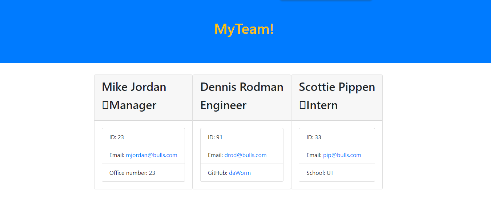

# Team-Profile-Generator


## Table of Content

- [Description](#description)
- [Deployment](#deployment)
  - [Dependencies](#dependencies)
  - [Demo](#demo)
  - [Download Zip](#download-zip)
  - [Clone](#clone)
- [Contributors](#Contributors)
- [License](#License)
- [Outro](#Outro)

## Description
Need a way to help track and display your work teacm members? Here it is a one stop shop to help you generate your webpages of colleagues.  



### Dependencies
- [Bulma](https://bootstrap.io/)
  - [NodeJS](https://nodejs.org/)
### Demo
You can access a live video link version at (https://drive.google.com/file/d/1gsCHsk8qH4Ckwu-yfAwG1EBtzpPa_2lc/view)

### Download Zip
1. Go to the repo on [GitHub](https://github.com/K-Bugz/team-profile-generator).
2. Click the green code button
   
3. Then click Download Zip button at the bottom.
   - Alternatively you can also [Click Here](https://github.com/DevJonTaylor/wing-map/archive/refs/heads/main.zip)
   
### Clone
1. Head to the [GitHub Repo](https://github.com/K-Bugz/team-profile-generator)
2. Click the green code.
   
3. Click the copy button or just highlight and copy the HTTPS url.
   
4. Go to Terminal apply the following command
```bash
git clone https://github.com/K-Bugz/team-profile-generator.git
```
## Contributors
- [Kevin Bugusky](https://github.com/K-Bugz)

## License
[MIT](./LICENSE)

## Outro
Thank you for stopping here and taking a look at my project. 
